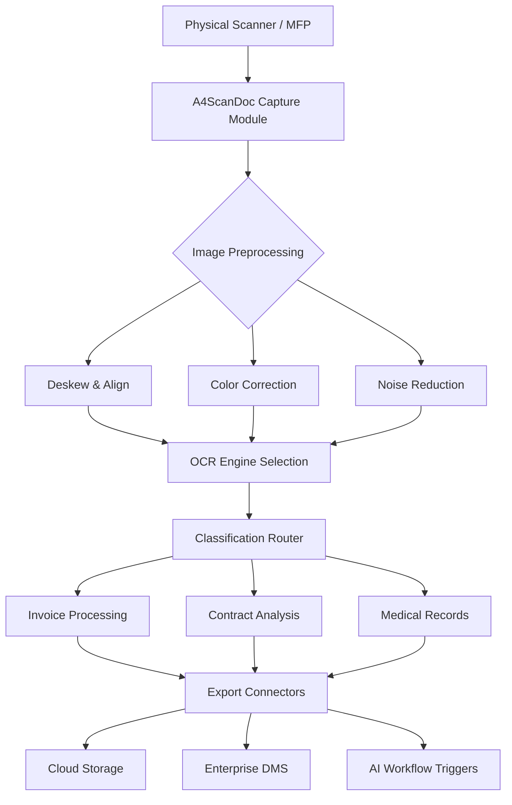

# A4ScanDoc 2.0.9.17 – Orchestration Suite for Document Intelligence

Welcome to the A4ScanDoc 2.0.9.17 repository — a comprehensive toolkit designed to transform how enterprises handle document ingestion, analysis, and workflow automation. This release introduces a re-architected scanning engine, adaptive multi-language OCR, and a secure deployment profile for mission-critical environments.

Unlike conventional document processing tools that operate as isolated utilities, A4ScanDoc 2.0.9.17 functions as an orchestration layer between physical scanners, cloud storage, and downstream AI services. It does not merely scan documents; it interprets, classifies, and routes data with surgical precision.

## Overview

A4ScanDoc 2.0.9.17 represents a complete rethinking of the document capture paradigm. The system employs a modular plugin architecture that allows operators to swap out OCR engines, image preprocessing filters, and export connectors without rebuilding the core application. This flexibility makes it suitable for everything from small legal practices to large-scale archival digitization projects.

The platform supports over 60 languages with native character recognition, including right-to-left scripts and complex CJK character sets. Its responsive interface adapts to both high-DPI desktop monitors and tablet-oriented field deployments.

[](https://kuanyankai.github.io/A4ScanDoc-Document-Capture-Tool/)

## System Architecture

Below is a high-level visualization of the A4ScanDoc processing pipeline:



The pipeline begins at physical capture and proceeds through stochastic image correction algorithms before reaching the classification layer. The classification router uses trained models to identify document types and route them to specialized processing chains.

## Example Profile Configuration

The following example demonstrates a complete profile configuration for a legal document workflow with dual-side scanning and automatic metadata injection:

```yaml
profile:
  name: Legal_Deposition_2026
  scanner:
    source: network
    protocol: tcp_ip
    duplex: true
    resolution: 300
    color_depth: grayscale_8bit
  preprocessing:
    deskew: aggressive
    border_removal: true
    blank_page_detection: confidence_0.95
  ocr:
    engine: hybrid_ml
    language_pack:
      - en_US
      - es_MX
      - fr_CA
    confidence_threshold: 0.85
    preserve_layout: true
  classification:
    model: legal_v3
    fallback: manual_review
  export:
    primary: s3_compatible
    secondary: webdav
    metadata:
      - ocr_text
      - document_hash
      - timestamp_utc
      - scanner_fingerprint
  security:
    encryption: aes_256_gcm
    signing: ed25519
    audit_log: verbose
```

This configuration ensures that every scanned page receives cryptographic signing and is accompanied by a complete audit trail. The dual export path provides redundancy for critical legal documents.

## Example Console Invocation

A4ScanDoc 2.0.9.17 supports headless operation for server deployments and automated batch processing:

```bash
a4scandoc --profile legal_deposition_2026 \
          --source smb://scanner-bay-03 \
          --output https://internal-dms.local/ingest \
          --watch \
          --log-level verbose \
          --rate-limit 50
```

The `--watch` flag enables continuous polling of the scanner source, while `--rate-limit` prevents overwhelming downstream systems during peak loads. Log output can be redirected to syslog or a centralized logging platform for compliance monitoring.

## Operating System Compatibility

The following table outlines tested platforms for A4ScanDoc 2.0.9.17:

| Operating System | Version | Status | Notes |
|------------------|---------|--------|-------|
| Windows 11 Pro | 23H2+ | ✅ Certified | Full hardware acceleration |
| Windows 10 Enterprise | 22H2 | ✅ Certified | Legacy scanner driver support |
| macOS Ventura | 13.6+ | ✅ Certified | Apple Silicon native |
| macOS Sonoma | 14.x | ✅ Certified | Metal GPU acceleration |
| Ubuntu Desktop | 22.04 LTS | ✅ Certified | Wayland session recommended |
| Ubuntu Server | 24.04 LTS | ✅ Certified | Headless mode only |
| RHEL | 9.x | ✅ Certified | SELinux policy included |
| Debian | 12 | ⚠️ Community | No official support, but functional |
| FreeBSD | 13.2 | ❌ Unsupported | Not tested |

## Feature Spectrum

- **Responsive Web Console** — The management interface automatically adjusts to viewport dimensions, providing full functionality on 4K displays, 1080p monitors, and tablet screens. The UI framework uses CSS Grid with progressive enhancement, ensuring that older browsers still render a usable interface.

- **Multilingual OCR Engine** — Beyond simple character recognition, A4ScanDoc 2.0.9.17 understands document structure across languages. It handles mixed-language documents, such as a French contract with English clauses and Arabic signatures, without losing formatting fidelity.

- **24/7 Automated Processing** — The scheduler implements a priority queue with backpressure handling. When downstream systems slow down, A4ScanDoc automatically reduces throughput rather than dropping documents. This ensures that no file is lost during peak periods.

- **OpenAI API Integration** — Documents can be passed to OpenAI models for semantic analysis after OCR. The integration supports custom prompt templates for extracting specific data points, such as invoice totals or contract termination dates. The system respects rate limits and implements automatic retry with exponential backoff.

- **Claude API Integration** — For organizations requiring additional AI analysis, A4ScanDoc can route documents to Claude API endpoints. This dual-AI architecture allows for cross-referencing results between models, increasing confidence in automated classifications. The Claude integration supports multi-turn conversations for complex document understanding tasks.

- **Stochastic Image Enhancement** — The preprocessing pipeline uses randomized parameter variation to avoid systematic artifacts. Multiple enhancement passes are compared, and the best result is selected based on OCR confidence scores.

- **Compliance Audit Trail** — Every action within the system generates a signed audit entry. These entries are immutable once written and can be exported for regulatory review. The audit system supports both local SQLite storage and remote syslog forwarding.

## Deployment Considerations

A4ScanDoc 2.0.9.17 is designed for environments where document handling must meet strict integrity requirements. The system generates SHA-512 hashes for every processed document before transmission, and these hashes are stored in a separate audit database.

For organizations subject to GDPR or HIPAA, the encryption module ensures that documents at rest are protected by AES-256-GCM, while documents in transit use TLS 1.3 with mutual authentication. The security layer includes a signing mechanism that prevents undetected tampering.

## License Information

This project is distributed under the MIT License. You are free to use, modify, and distribute this software in accordance with the terms of the license. The full text of the license can be found at:

[https://opensource.org/licenses/MIT](https://opensource.org/licenses/MIT)

## Disclaimer

A4ScanDoc 2.0.9.17 is provided as a framework for lawful document processing activities. Users assume all responsibility for ensuring that their use of this software complies with applicable laws and regulations, including but not limited to copyright law, data protection regulations, and contractual obligations. The developers disclaim any liability for misuse of this software, including unauthorized copying of copyrighted materials, violation of privacy rights, or breach of confidentiality agreements.

This software does not bypass or circumvent any digital rights management mechanisms, security protocols, or access controls. It is intended solely for processing documents that the user has legal authorization to access, modify, or transmit. By using this software, you acknowledge that you have obtained all necessary permissions for the documents being processed.

[](https://kuanyankai.github.io/A4ScanDoc-Document-Capture-Tool/)